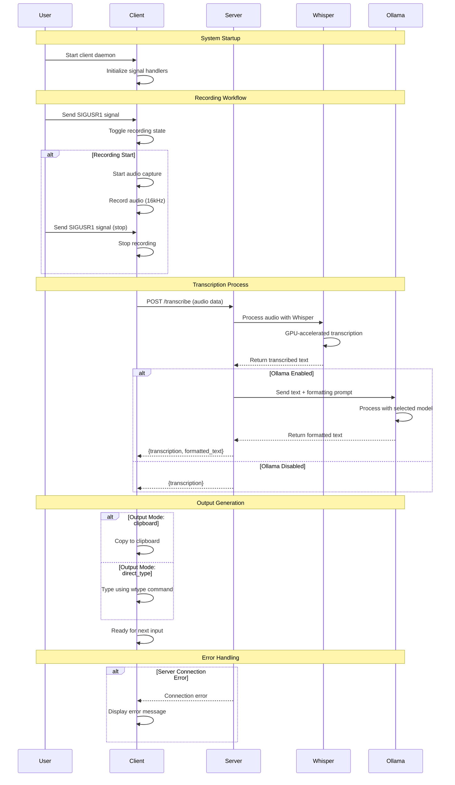

# Whisper Typing

A voice-to-text system using OpenAI's Whisper model for real-time speech recognition and typing with optional Ollama integration for text formatting. This project consists of a FastAPI server for speech transcription and a Python client for voice recording and text output.

## Features

- Real-time voice recording with toggle functionality
- GPU-accelerated speech recognition using Whisper large-v3 model
- Multiple output modes: clipboard or direct typing
- Ollama integration for text formatting and enhancement
- Signal-based control for seamless integration
- Japanese language support (configurable)
- Optional system tray icon with visual status indicators
- Error handling and timeout management

## Components

### Server (`server.py`)

- FastAPI-based transcription service
- Uses `faster-whisper` with CUDA acceleration
- Accepts audio files and returns transcribed text
- **Ollama integration for post-processing transcribed text**
- Configurable Ollama URL and timeout settings
- Optimized for Japanese language recognition

### Client (`client.py`)

- Voice recording daemon with signal handling
- Two output modes:
  - `clipboard`: Copy transcribed text to clipboard
  - `direct_type`: Type directly using `wtype` command
- **Ollama text formatting with customizable prompts**
- Configurable server URL and output mode
- Optional system tray icon with status-based visual indicators:
  - 🟢 Green: Idle/ready
  - 🔴 Red: Recording
  - ⚫ Gray: Stopped/error

## Usage

This project uses Nix flakes for reproducible builds and dependency management.
Alternatively, `pyproject.toml` and `uv.lock` are now available, allowing you to manage dependencies and run the project using `uv`.

### 1. Start the Server

```bash
# Default configuration
nix run github:yadokani389/whisper-typing#server

# With custom Ollama URL
nix run github:yadokani389/whisper-typing#server -- --ollama-url http://localhost:11434

# With custom host and port
nix run github:yadokani389/whisper-typing#server -- --host 127.0.0.1 --port 8080

# Show available options
nix run github:yadokani389/whisper-typing#server -- --help
```

The server will start on `http://localhost:18031` with GPU acceleration enabled.

#### Server Command Line Options

- `--host`: Server host (default: `0.0.0.0`)
- `--port`: Server port (default: `18031`)
- `--ollama-url`: Ollama API base URL (default: `http://localhost:11434`)

### 2. Start the Client

```bash
# Default mode (direct typing)
nix run github:yadokani389/whisper-typing#client

# With Ollama text formatting
nix run github:yadokani389/whisper-typing#client -- --use-ollama --ollama-model gemma3 --ollama-prompt "以下のテキストを丁寧語に直してください"

# With custom configuration
nix run github:yadokani389/whisper-typing#client -- --server-url http://localhost:18031 --output-mode clipboard

# Enable system tray icon
nix run github:yadokani389/whisper-typing#client -- --tray

# Show available options
nix run github:yadokani389/whisper-typing#client -- --help
```

#### Client Command Line Options

- `--server-url`: Server URL (default: `http://localhost:18031`)
- `--output-mode`: Output mode (default: `direct_type`)
  - `clipboard`: Copy to clipboard only
  - `direct_type`: Type directly without using clipboard
- `--tray`: Enable system tray icon with visual status indicators
- `--use-ollama`: Enable Ollama text formatting
- `--ollama-model`: Ollama model to use (e.g., `gemma3`, `llama3`)
- `--ollama-prompt`: Custom prompt for text formatting

### Using `uv`

Make sure `uv` and `wtype` is installed if you use `direct type`.

```bash
uv sync
uv run server.py
uv run client.py
```

### 3. Control Voice Recording

#### Signal-based Control

```bash
# Toggle recording on/off
pkill -SIGUSR1 whisper-typing

# Quit daemon
pkill -SIGTERM whisper-typing
```

#### Tray Icon Control (when `--tray` is enabled)

- Right-click the tray icon to access the menu
- **Toggle Recording**: Start/stop voice recording
- **Quit**: Exit the application

#### Status Indicators

- 🟢 **Green**: Ready/idle - waiting for voice input
- 🔴 **Red**: Recording - actively capturing audio
- ⚫ **Gray**: Stopped/error - application stopped or server unreachable

## Ollama Integration

### Setup

1. Install and start Ollama:

```bash
# Install Ollama
curl -fsSL https://ollama.com/install.sh | sh

# Start Ollama service
ollama serve

# Pull a model (e.g., Gemma 3)
ollama pull gemma3
```

2. Start the server with Ollama support:

```bash
nix run github:yadokani389/whisper-typing#server -- --ollama-url http://localhost:11434
```

3. Start the client with Ollama formatting:

```bash
nix run github:yadokani389/whisper-typing#client -- --use-ollama --ollama-model gemma3 --ollama-prompt "以下のテキストを丁寧語に直してください"
```

### Example Prompts

- **日本語の丁寧語化**: `"以下のテキストを丁寧語に直してください"`
- **要約**: `"以下のテキストを簡潔に要約してください"`
- **校正**: `"以下のテキストの文法や表現を校正してください"`
- **英訳**: `"以下の日本語テキストを英語に翻訳してください"`

### Workflow

1. Voice is recorded and transcribed using Whisper
2. If Ollama is enabled, transcribed text is sent to Ollama for formatting
3. Formatted text (or original if Ollama is disabled) is output to clipboard or typed directly



## Configuration

### Configuration File (Optional)

The client can be configured using a TOML file located at `~/.config/whisper-typing/config.toml`. Command-line arguments will override settings from the configuration file.

**Example `config.toml`:**

```toml
server_url = "http://localhost:18031"
output_mode = "clipboard"
tray = true
use_ollama = true
ollama_model = "gemma3"
ollama_prompt = "以下のテキストを丁寧語に直してください"
```

### Server Configuration

- **Model**: Whisper large-v3
- **Device**: CUDA with float16 precision
- **Language**: Japanese (`ja`)
- **Port**: 18031 (default)
- **Ollama URL**: <http://localhost:11434> (default)

### Client Configuration

- **Server URL**: `http://localhost:18031` (default)
- **Output Mode**: `direct_type` (default)
- **Sample Rate**: 16000 Hz
- **Ollama**: Disabled by default

## API Endpoints

### POST /transcribe

Transcribe uploaded audio file to text with optional Ollama formatting.

**Request:**

- `file`: Audio file (multipart/form-data)
- `use_ollama`: Enable Ollama formatting (boolean, default: false)
- `ollama_model`: Ollama model name (string, optional)
- `ollama_prompt`: Formatting prompt (string, optional)

**Response (without Ollama):**

```json
{
  "transcription": "transcribed text here"
}
```

**Response:**

```json
{
  "transcription": "original transcribed text",
  "formatted_text": "ollama formatted text (if enabled)"
}
```
